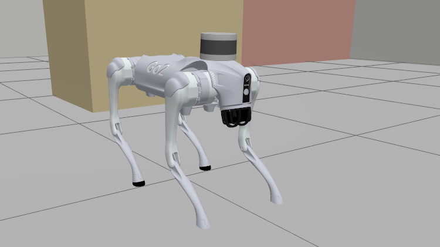
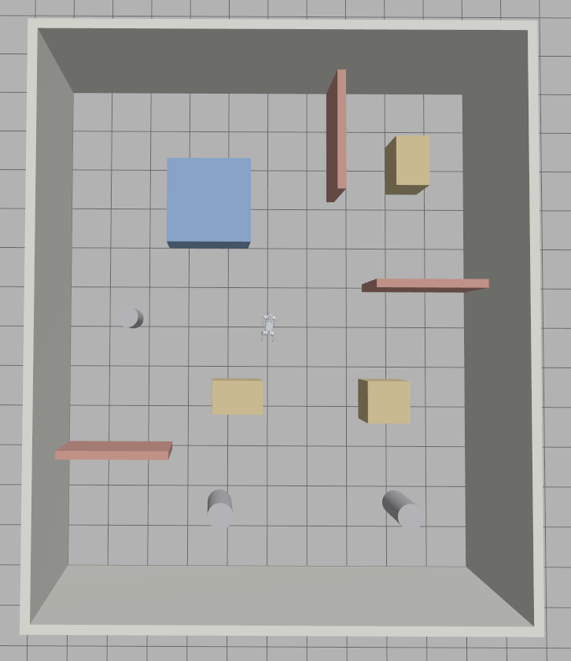
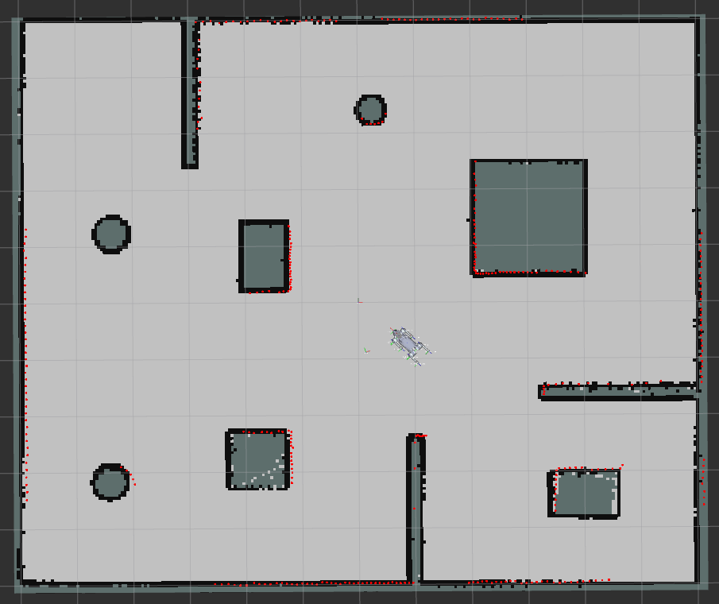
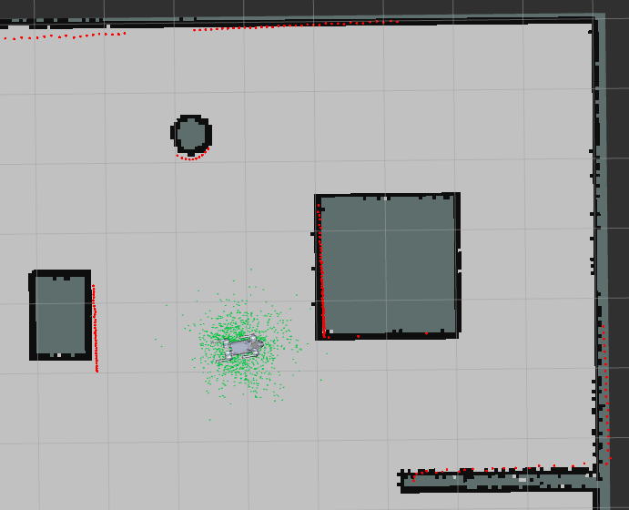
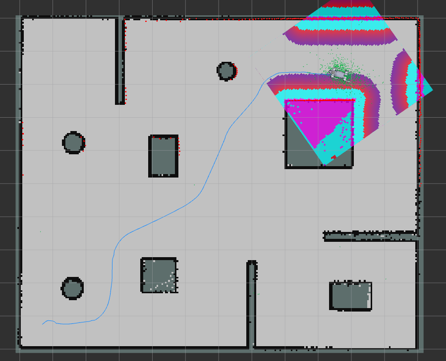
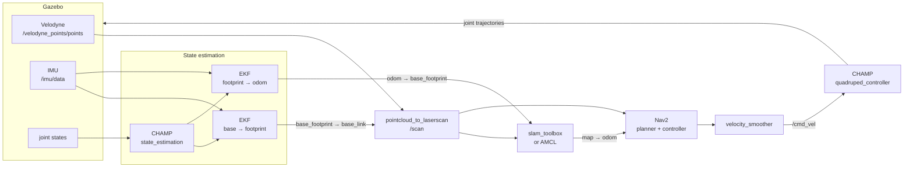

# Unitree Go2 — 2D Navigation Stack for ROS 2 Jazzy


A complete 2D autonomy stack for the Unitree Go2 quadruped in Gazebo: build a map
with SLAM, localize on it with AMCL, then send the robot to a goal with Nav2.

<p align="center">
  
</p>

---

## The Unitree Go2

The [Go2](https://www.unitree.com/go2) is a quadrupedal robot from Unitree
Robotics. Four legs with three actuated joints each give it twelve degrees of
freedom, which is what lets it keep its balance on ground a wheeled base could
not cross — and what makes controlling it considerably harder.

This repository does not talk to real hardware. Everything below describes the
robot **as modelled in this simulation**, taken from the URDF so the numbers match
what actually runs. For the physical robot's specifications see
[Unitree's page](https://www.unitree.com/go2).

| | As modelled here |
|---|---|
| Total mass | 15.1 kg (6.92 kg trunk + 4 × 2.04 kg legs) |
| Body | 0.376 m long, 0.114 m tall |
| Hip spacing | 0.387 m front-to-back, 0.284 m across |
| Leg segments | 0.213 m thigh + 0.213 m calf |
| Actuated joints | 12 — hip, thigh and calf on each leg |
| Joint limits | hip ±60°, thigh −90°…+200°, calf −48°…−156° |
| Peak joint torque | 23.7 N·m |
| Standing height | 0.225 m (nominal, set by the gait) |
| Gait speed limits | 0.30 m/s forward, 0.25 m/s lateral, 0.50 rad/s turning |

The gait limits are the ones that matter in practice. Command more than these and
the controller clips the request, the gait degrades, and the robot can end up on
its back — see [Quick start](#quick-start).

### The CHAMP controller

Locomotion is handled by [CHAMP](https://github.com/chvmp/champ), an open-source
quadruped framework. It takes a velocity command on `/cmd_vel` and turns it into
joint trajectories for all twelve actuators, running the gait pattern, the leg
inverse kinematics and the body pose controller.

From the navigation stack's point of view CHAMP is the layer that makes a legged
robot look like something you can send a `Twist` to. Most of Nav2 does not need to
know there are legs involved — though as this project found out, the differences
leak through in ways worth knowing about.

---

## What this repository adds

The upstream project gets the Go2 walking in Gazebo. This repository takes it from
"walks when you drive it" to "maps, knows where it is, and drives itself":

- **A generated course** with a validated layout, replacing the bundled worlds
- **2D SLAM** producing a saved map of the course
- **AMCL localization**, including recovery from the kidnapped-robot case
- **Nav2 navigation** that reaches goals without collisions or falls
- **Fourteen diagnostic tools** that check each of the above against the
  simulator's ground truth

That last point is the method the rest of this README rests on, and it is worth
more than any single figure in it.

### A record of what went wrong

Getting a legged robot to map and navigate is not a matter of launching the right
nodes. Most of the work was finding out *why* things that looked correct were
wrong: a map that never grew, a laser scan silently rotated by 100°, a particle
filter that got less certain the longer it ran.

**[docs/TROUBLESHOOTING.md](docs/TROUBLESHOOTING.md)** — twenty problems, each
with the symptom you actually see, the command that identifies it, and the fix.

If you are building something similar and stuck, start there. Several of these
bugs produce symptoms that point at the wrong subsystem entirely.

---

## What works

| Capability | Status | Notes |
|---|---|---|
| Gazebo simulation + CHAMP gait | ✅ | walks at 0.15–0.20 m/s |
| IMU | ✅ | 100 Hz |
| 3D LiDAR (Velodyne VLP-16) | ✅ | 440 × 16 points, 10 Hz |
| RGB camera | ✅ | 640 × 480, 10 Hz |
| 2D laser scan from the 3D cloud | ✅ | `pointcloud_to_laserscan` |
| 2D SLAM | ✅ | `slam_toolbox`, async |
| Localization on a saved map | ✅ | `nav2_amcl` |
| Global relocalization after kidnap | ✅ | `/reinitialize_global_localization` |
| Autonomous navigation to a goal | ✅ | Nav2, no collisions, no falls |
| Diagnostic tooling | ✅ | 14 scripts under `unitree_go2_sim/tools/` |
| 4D LiDAR (Unitree L1) | ⚠️ | publishes, nothing consumes it |
| Depth camera | ❌ | see [integrable](#not-included-but-integrable) |
| 3D obstacle avoidance | ❌ | costmaps use a 2D slice |
| Stairs / rough terrain | ❌ | gait is tuned for flat ground |

### Measured results

| Metric | Value | How it was measured |
|---|---|---|
| Map accuracy | **99.4 %** of occupied cells within 10 cm | every cell compared to the world's real geometry |
| Map surface coverage | **100 %** of real surfaces mapped | the opposite question: what the map is missing |
| Map median error | **0.4 cm** | worst cell 10.4 cm |
| Localization error | **0.11 m** median, 0.19 m at p90 | AMCL pose vs Gazebo ground truth |
| Heading error | **4.2°** median | same run |
| Scan accuracy | **92 %** of rays within 10 cm | ray-cast the known world from the true pose |
| Odometry — rotation | **0.3 %** over a full turn | `/odom` vs ground truth |
| Odometry — translation | 2–18 %, grows with distance | the weak axis; SLAM corrects it |

All of these were taken in [the course](#the-course) below, and would mean
something different in another room.

---

## System requirements

- Ubuntu 24.04
- ROS 2 Jazzy
- Gazebo Sim Harmonic
- A GPU capable of `ogre2`; the LiDAR is a `gpu_lidar` and will not render without it

The simulation runs at roughly **0.6× real time** on a mid-range laptop. That is
expected and harmless — everything uses `use_sim_time` — but wall-clock waits are
longer than the numbers suggest.

---

## Installation

The dependency list and build steps below come from the upstream project,
[RobInLabUJI/unitree_go2_ros2_jazzy](https://github.com/RobInLabUJI/unitree_go2_ros2_jazzy),
with the packages this repository adds appended.

### 1. ROS 2 dependencies

```bash
sudo apt update
sudo apt install ros-jazzy-gazebo-ros2-control \
                 ros-jazzy-xacro \
                 ros-jazzy-robot-localization \
                 ros-jazzy-ros2-controllers \
                 ros-jazzy-ros2-control \
                 ros-jazzy-velodyne \
                 ros-jazzy-velodyne-description
```

### 2. Navigation dependencies — added here

```bash
sudo apt install ros-jazzy-pointcloud-to-laserscan \
                 ros-jazzy-slam-toolbox \
                 ros-jazzy-navigation2 \
                 ros-jazzy-nav2-bringup \
                 ros-jazzy-teleop-twist-keyboard
```

### 3. Clone

```bash
cd ~/ros2_ws/src
git clone https://github.com/<your-username>/unitree_go2_ros2_jazzy.git
```

### 4. Resolve and build

```bash
cd ~/ros2_ws
rosdep update
rosdep install --from-paths src --ignore-src -r -y
colcon build
source install/setup.bash
```

---

## The course

`simple_room.sdf` is a 12 × 10 m room with walls, a central block, three partition
walls, three pillars and three crates. Everything is a box or a cylinder — no
meshes, no textures — so it costs almost nothing to simulate.

<p align="center">
  
  <br>
  <em>The course seen from above. The robot spawns in the middle, where every
  direction is open.</em>
</p>

It is **generated, not hand-written**.
[`unitree_go2_description/tools/gen_simple_room.py`](unitree_go2_description/tools/gen_simple_room.py)
emits the SDF and validates the layout before writing it:

- at least **1.2 m** of clear floor between any two obstacles, so a 0.31 m-wide
  robot can pass anywhere it fits at all
- a clear disc around the spawn point
- every obstacle tall enough to appear in the laser slice — a shorter prop would
  be invisible to the 2D map while still blocking the robot
- **no mirror symmetry**, so global relocalization cannot converge on the wrong
  hypothesis

The first run of that validator rejected six placements that looked fine by eye.

To change the course, edit the `OBSTACLES` list in the generator and re-run it.
The diagnostic tools read the same definition, so they stay in sync automatically.

---

## Quick start

Make the robot walk. Everything else in this repository is built on top of this
working, so it is worth confirming first.

```bash
# Terminal 1 — simulator, robot, controllers
ros2 launch unitree_go2_sim unitree_go2_launch.py rviz:=false
# wait for: joint_group_effort_controller ... active   (~35 s)

# Terminal 2 — drive it
ros2 run teleop_twist_keyboard teleop_twist_keyboard \
  --ros-args -p speed:=0.3 -p turn:=0.4
```

The speed arguments are deliberate. `gait.yaml` caps the robot at 0.3 m/s and
0.5 rad/s, and teleop's defaults (0.5 / 1.0) exceed both — CHAMP then clips the
command and the gait degrades. These are the values `tour.py` drives at for a
quarter of an hour at a stretch without falling. Stop before turning; stepping straight from
forward motion into a hard turn is what puts this robot on its back.

From here, [Usage](#usage) goes through the stack one stage at a time: build a
map, localize on it, then hand the robot to Nav2.

Stopping everything cleanly matters more than usual here — see
[Stale processes](#stale-processes).

---

## Usage

Each stage below builds on the one before it, and each is worth running on its own
before the next: a map you do not trust makes localization look broken, and
localization you have not checked makes Nav2 look broken.

### 1. Mapping a new world

```bash
# Terminal 1
ros2 launch unitree_go2_sim unitree_go2_launch.py rviz:=false
# Terminal 2
ros2 launch unitree_go2_sim slam_2d.launch.py
# Terminal 3 — drive
ros2 run teleop_twist_keyboard teleop_twist_keyboard --ros-args -p speed:=0.3 -p turn:=0.4
```

Drive a full loop and return to where you started — that closure is what lets
slam_toolbox correct accumulated drift. Stay **more than 0.6 m from walls**: the
Velodyne cannot see closer than 0.5 m, so a wall you press against disappears
from the scan and the map leaks through it.

Save when done:

```bash
ros2 run nav2_map_server map_saver_cli -f <path>/unitree_go2_sim/maps/my_map
```

<p align="center">
  
  <br>
  <em>The finished map in RViz. The red points are the live 2D scan, lying on the
  occupancy grid slam_toolbox has built from it.</em>
</p>

### 2. Localization only

```bash
ros2 launch unitree_go2_sim localization_2d.launch.py \
  map:=$HOME/ros2_ws/src/unitree_go2_ros2_jazzy/unitree_go2_sim/maps/simple_room.yaml
```

AMCL is seeded at the spawn pose by default. Use **2D Pose Estimate** to place it
elsewhere. If the robot gets moved without the filter knowing — the *kidnapped
robot* case — AMCL cannot recover on its own. Scatter the particles across the
whole map instead:

```bash
ros2 service call /reinitialize_global_localization std_srvs/srv/Empty
```

Then drive a few metres; the cloud converges.

<p align="center">
  
  <br>
  <em>AMCL on the saved map. Each green arrow is one hypothesis about where the robot
  is; they have collapsed onto a cluster a few centimetres across instead of spreading
  through the room, which is what a filter that has found itself looks like.</em>
</p>

### 3. Full navigation

```bash
ros2 launch unitree_go2_sim bringup_2d.launch.py
```

With no `map:=` argument this uses the map that ships with the repository, so it
works before you have built one of your own.

RViz opens after about 20 seconds. Press **2D Goal Pose**, click a point on the
open grey floor, drag to set the heading, release. The robot plans and walks there.

<p align="center">
  
  <br>
  <em>A goal in the far corner. The blue line is NavFn's global plan, curving around
  the obstacles it knows from the map; the coloured patch is the local costmap, built
  live from the laser as the robot moves. Green dots are AMCL's particles.</em>
</p>

Localization and navigation come up in the right order. The order is a hard dependency:
without `map_server` there is no `/map` and no map frame, so every Nav2 costmap
waits on a transform that never arrives and the lifecycle manager eventually
gives up. Nothing in that error says "localization is not running", which is why
they are launched together.

---

## Sensors and technologies

### On the robot

| Sensor | Specification | Topic | Used for |
|---|---|---|---|
| **Velodyne VLP-16** (`gpu_lidar`) | 440 × 16 rays, 360° × ±15°, 0.5–131 m, 10 Hz | `/velodyne_points/points` | flattened into `/scan` for SLAM, AMCL and the costmaps |
| **Unitree L1 4D LiDAR** (`gpu_lidar`) | 600 × 30 rays, 360° × ±45°, 0.8–30 m, 10 Hz | `/unitree_lidar/points` | nothing yet — bridged but unconsumed |
| **RGB camera** | 640 × 480, 78° HFOV, 10 Hz | `/rgb_image` | nothing yet |
| **IMU** | 100 Hz, Gaussian noise on rates and accelerations | `/imu/data` | attitude and yaw rate for both EKFs |
| **Ground-truth odometry** | Gazebo plugin, 50 Hz | `/odom/ground_truth` | **measurement only** — never fed to the stack |

That last row is the backbone of the whole approach: because the simulator knows
where the robot really is, every component can be scored against truth instead of
judged by eye. It is bridged read-only and never reaches the control path, so
nothing in the stack can quietly come to depend on knowing the answer.

### Software stack

| Layer | Package | Role |
|---|---|---|
| Gait and kinematics | **CHAMP** | converts `/cmd_vel` into leg joint trajectories |
| State estimation | **robot_localization** | two EKFs: body attitude, and odometry fusion |
| Scan conversion | **pointcloud_to_laserscan** | 3D cloud → 2D `/scan` |
| Mapping | **slam_toolbox** | pose-graph SLAM, publishes `map → odom` |
| Localization | **nav2_amcl** | particle filter on a saved map |
| Navigation | **Nav2** | NavFn planner, Regulated Pure Pursuit controller, behaviour tree |
| Smoothing | **nav2_velocity_smoother** | acceleration limits — abrupt commands topple this robot |

---

## Architecture



The TF chain is `map → odom → base_footprint → base_link → velodyne`, and every
link matters. Three of the worst bugs in this project were a single broken link in
that chain producing symptoms that looked like SLAM, navigation or sensor faults.

---

## Diagnostic tools

Fourteen scripts under
[`unitree_go2_sim/tools/`](unitree_go2_sim/tools/), one per question worth asking
of the stack. They are **not** unit tests — each needs a running simulation, and
some drive the robot.

| Tool | Answers |
|---|---|
| `odom_quality.py` | how far does odometry drift, separately for straight lines and turns |
| `check_scan.py` | is `/scan` geometrically correct, or is SLAM mishandling good data |
| `score_map.py` | how close is a saved map to the real world |
| `align_score.py` | is a bad map merely shifted, or internally distorted |
| `amcl_quality.py` | localization error, and is the particle cloud converging |
| `kidnap_recovery.py` | can the robot find itself again after being moved |
| `nav_test.py` | does Nav2 reach goals, how far does it detour, how close does it pass |
| `costmap_ghosts.py` | how many costmap cells are marked where the world is empty |
| `tour.py` | drive a planned lawnmower tour of the course, for a complete map |
| `explore.py` | wander the course without touching anything, for gait testing |
| `gait_stability.py` | does the robot fall, and was it a collision or open-ground instability |
| `scan_probe.py` | one-shot health check of cloud, scan and map |
| `crop_map.py` | trim unexplored border from a saved map, adjusting the origin with it |
| `stop_sim.sh` | stop every simulation process |

Full descriptions and healthy value ranges: [tools/README.md](unitree_go2_sim/tools/README.md)
*(currently written in Turkish)*.

### Stale processes

`stop_sim.sh` exists because leftover nodes silently corrupt measurements. At one
point five `slam_toolbox` instances were running at once, publishing to `/scan` at
two different resolutions. Run it before relaunching:

```bash
bash unitree_go2_sim/tools/stop_sim.sh    # prints the number of processes left
```

---

## Problems and solutions

The nine most instructive failures. Full symptom → diagnosis → fix writeups are in
**[docs/TROUBLESHOOTING.md](docs/TROUBLESHOOTING.md)**.

| Symptom | Real cause |
|---|---|
| No LiDAR or camera data at all, though the topics exist | the world was missing `gz-sim-sensors-system`, so Gazebo never rendered them |
| Map never grows, and appears stuck to the robot | `base_footprint` sat 0.4 m below the floor, so the laser slice cut the ground and mapped a ring that travelled with the robot |
| Star-shaped spokes punching through walls in the map | scan angular resolution matched the sensor's exactly; empty bins became "free to max range" |
| Map internally distorted, no alignment fixes it | the scan was rotated ~100° by a drifting yaw in `base_footprint → base_link` |
| SLAM never sees the robot turn | CHAMP's leg odometry reported the wrong sign; fused against a correct IMU it cancelled to zero |
| Particle cloud spreads instead of converging | motion-model noise was guessed, not measured — and loaded onto the *accurate* axis |
| Particle cloud invisible in RViz | AMCL publishes `nav2_msgs/ParticleCloud`; the stock `PoseArray` display renders nothing and reports no error |
| Robot grazes obstacles, then the planner cannot escape | the local costmap had no static layer, so obstacles vanished inside the LiDAR's 0.5 m blind zone |
| Phantom obstacles flicker in open floor | body tilt lifts distant floor returns into the laser slice |

---

## Not included, but integrable

Realistic next steps, roughly by value:

**Autonomous exploration.** Frontier-based exploration would close the loop:
find the boundary between known free space and unknown, send Nav2 there, repeat
until the map is complete. `explore_lite` is not packaged for Jazzy, but the
algorithm is short enough to write against `/map` and `/goal_pose`.

**3D obstacle avoidance.** The Velodyne has 16 vertical rings and the costmaps use
a single horizontal slice of them. Nav2's `ObstacleLayer` accepts `PointCloud2`
directly with `min_obstacle_height` / `max_obstacle_height`, so the full cloud
could feed the costmap while `/scan` continues to serve AMCL. This would also
address the phantom-obstacle problem at its root rather than by limiting range.

**Real foot contact sensors.** CHAMP currently infers foot contacts from the gait
phase rather than measuring them — the fallback that had to be enabled to fix the
`base_footprint` bug. Gazebo has `contact` sensors; four of them plus a small
converter node would make state estimation measured instead of assumed.

**Waypoint following.** `nav2_waypoint_follower` is installed and already
configured in `nav2_params.yaml` — it only needs adding to the navigation launch.

**Depth camera.** Gazebo's `rgbd_camera` and `depthimage_to_laserscan` open the
door to visual SLAM or a second obstacle source.

**Stairs and rough terrain.** The point of a quadruped. Adding a ramp to the
course generator is easy; CHAMP's flat-ground gait probably will not cope, which
makes it an interesting experiment rather than a quick win.

---

## Known limitations

- **Path efficiency.** The robot walks roughly twice the straight-line distance to
  a goal. The planner produces a short path; the gap is in how the controller
  follows it.
- **Goal precision.** Nav2 checks its tolerance against AMCL's estimate, so true
  goal error reaches about 0.5 m.
- **LiDAR blind zone.** 0.5 m minimum range is structural. The static costmap layer
  works around it; nothing removes it.
- **Gait stability.** Fine at 0.15 m/s for minutes at a time; higher speeds and
  hard turns can put the robot on its back.

---

## Credits and attribution

Built on **[RobInLabUJI/unitree_go2_ros2_jazzy](https://github.com/RobInLabUJI/unitree_go2_ros2_jazzy)**,
which this repository started from — the robot description, the CHAMP
integration and the installation procedure come from there.

With **[chvmp/champ](https://github.com/chvmp/champ)** (the quadruped
controller, vendored here, BSD-3-Clause — see
[champ/include/champ/LICENSE](champ/include/champ/LICENSE)),
**[Unitree Robotics](https://www.unitree.com/)** (the Go2 model),
**[Nav2](https://docs.nav2.org/)** and
**[slam_toolbox](https://github.com/SteveMacenski/slam_toolbox)**.

> **Licensing note:** the upstream repository carries no top-level license, so the
> terms for derivative work are unclear and this repository deliberately adds none
> of its own. If you want to reuse any of this, ask the upstream authors first.
